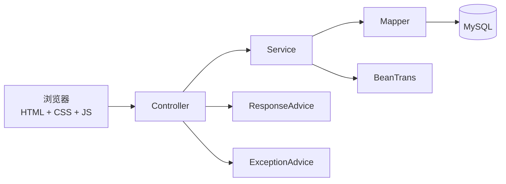
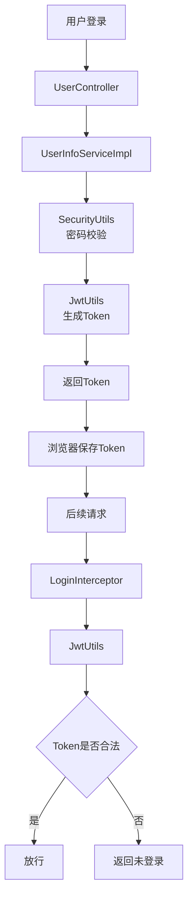
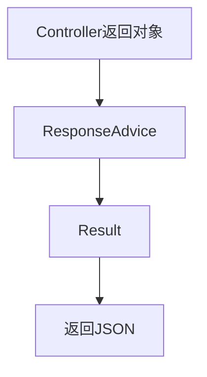
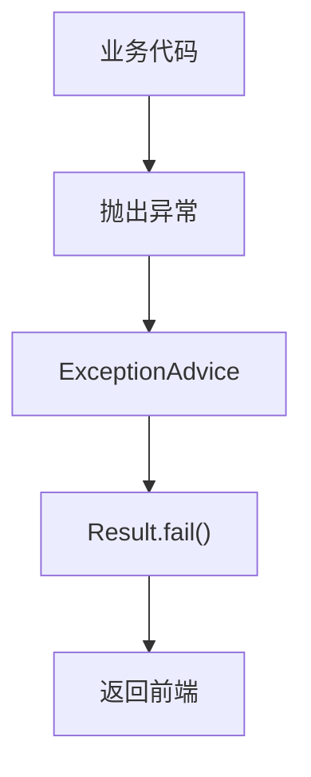

# 📝 Spring Blog Demo

> 基于 Spring Boot + MyBatis-Plus 开发的前后端分离博客系统。

实现了：

- 🔐 用户登录（JWT）
- 📝 博客发布
- 📖 博客浏览
- ✏️ 博客修改
- 🗑️ 博客删除
- 🔒 登录拦截
- 📦 统一返回格式
- ⚠️ 全局异常处理

---

# 🚀 技术栈

| 技术 | 说明 |
|------|------|
| Spring Boot | Web框架 |
| MyBatis-Plus | ORM框架 |
| MySQL | 数据库 |
| Maven | 项目管理 |
| JWT | 登录认证 |
| HTML/CSS/JavaScript | 前端页面 |
| Ajax + jQuery | 前后端交互 |

---

# 📂 项目结构

```text
spring-blog-demo
│
├── controller      控制层
├── service         业务层
│   └── impl        业务实现
├── mapper          数据访问层
├── pojo
│   ├── dataobject  实体对象
│   ├── request     请求对象
│   └── response    响应对象
├── common
│   ├── advice
│   ├── interceptor
│   ├── exception
│   ├── enums
│   └── util
├── config          Spring配置
└── resources
    ├── static
    ├── mapper
    └── application.yml
```

---

# 🔄 系统整体架构



---

# 🔐 登录认证流程



---

# 📦 统一响应流程



---

# ⚠️ 异常处理流程



---

# 📁 数据库

### user_info

| 字段 | 说明 |
|------|------|
| id | 用户ID |
| user_name | 用户名 |
| password | 密码 |
| github_url | GitHub地址 |
| delete_flag | 删除标识 |

---

### blog_info

| 字段 | 说明 |
|------|------|
| id | 博客ID |
| title | 标题 |
| content | 内容 |
| user_id | 作者ID |
| delete_flag | 删除标识 |

---

# ▶️ 项目启动

```bash
git clone ...

cd spring-blog-demo

mvn spring-boot:run
```

浏览器访问：

```
http://localhost:8080/blog_login.html
```

---

# 📸 项目展示

（这里放登录页、博客首页、编辑页截图）


